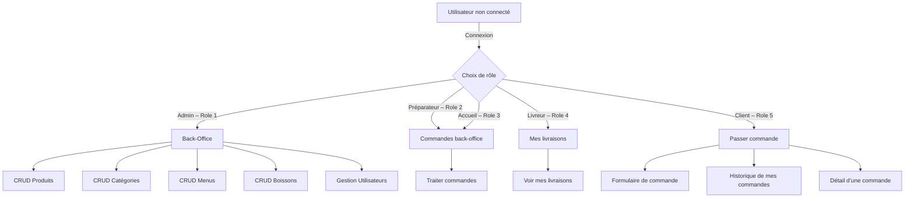

# Wacdo – Back-office & Client Order Management

Ce projet **Wacdo** fournit une interface **back-office** pour gérer le catalogue (produits, menus, boissons) et les commandes, ainsi qu’une interface **client** simple permettant de passer et consulter ses commandes. Développé en **PHP 8** (architecture MVC) avec une base **MySQL**, il intègre également les exigences **RGPD** (consentement, anonymisation).

---

## Table des matières
1. [Prérequis](#prérequis)
2. [Installation](#installation)
3. [Configuration](#configuration)
4. [Base de données](#base-de-données)
5. [Exemples de requêtes SQL](#exemples-de-requêtes-sql)
6. [Démarrage de l’application](#démarrage-de-lapplication)
7. [Structure du projet](#structure-du-projet)
8. [Tests](#tests)
9. [Couverture des tests](#couverture-des-tests)
10. [RGPD](#rgpd)
11. [Spécifications fonctionnelles](#spécifications-fonctionnelles)
12. [Schéma fonctionnel](#schéma-fonctionnel)
13. [Sécurité et rôles](#sécurité-et-rôles)
14. [Déploiement](#déploiement)

---

## Prérequis
- **PHP** ≥ 8.1 (testé sous 8.4)
- **Composer** ≥ 2.0
- **MySQL** ≥ 5.7 ou 8.x
- Extensions PHP : `pdo_mysql`, `mbstring`, `openssl`, `json`
- **Git**, un éditeur de code ou IDE (VS Code, PhpStorm, Sublime…)

---

## Installation
1. **Cloner le dépôt**
   ```bash
   git clone https://github.com/Saldyr/wacdo.git
   cd wacdo
   ```
2. **Installer les dépendances**
```bash
composer install
```
3. **Configurer la base de données**
   - Ouvrez `config/db.php` et renseignez vos paramètres MySQL : hôte, port, nom BD, utilisateur, mot de passe.
4. **Créer la base et exécuter les migrations**
```bash
   # Import global
   mysql -u <votre_user> -p <nom_bd> < wacdo.sql
```

   ## Installation / migrations

```md
Exécution séquentielle :
```bash
mysql -u <user> -p <db> < migrations/001_create_role.sql
mysql -u <user> -p <db> < migrations/002_create_utilisateurs.sql
mysql -u <user> -p <db> < migrations/003_create_categorie.sql
mysql -u <user> -p <db> < migrations/004_create_produit.sql
mysql -u <user> -p <db> < migrations/005_create_boisson.sql
mysql -u <user> -p <db> < migrations/006_create_menu.sql
mysql -u <user> -p <db> < migrations/007_create_menu_produit.sql
mysql -u <user> -p <db> < migrations/008_create_commande.sql
mysql -u <user> -p <db> < migrations/009_create_commande_produit.sql
mysql -u <user> -p <db> < migrations/010_create_commande_boisson.sql
mysql -u <user> -p <db> < migrations/011_create_commande_menu.sql
mysql -u <user> -p <db> < migrations/012_add_consentement_utilisateurs.sql
mysql -u <user> -p <db> < migrations/013_add_is_active_to_utilisateur.sql
```
---

## Configuration
Toutes les options de connexion sont centralisées dans `config/db.php` :
```php
<?php
return [
   'host'     => '127.0.0.1',
   'port'     => 3306,
   'database' => 'wacdo',
   'username' => 'root',
   'password' => '',
];
```
La classe `lib/Database.php` lit ces valeurs pour établir la connexion PDO.

---

## Base de données
- Les scripts SQL sont dans le dossier `migrations/` numérotés de **001** à **013**.
- Un dump global est disponible sous `wacdo.sql`.
- Le schéma conceptuel (ERD) se trouve dans `docs/ERD_Wacdo.svg`.
Notes de schéma :
- La boisson rattachée à une commande est stockée dans la table `commande_boisson` (colonne `quantity`),
  pas dans `commande` (il n’y a PAS de `commande.boisson_id`).
- Les FK ont été revues : 
  * Tables de liaison (commande_* et menu_produit) : ON DELETE CASCADE.
  * `commande.user_id` / `commande.livreur_id` → `utilisateur.user_id` : ON DELETE SET NULL.
  * `produit.category_id` → `categorie.category_id` : ON DELETE RESTRICT.


---

## Exemples de requêtes SQL

1. **Nombre de commandes par utilisateur (actifs)**
```sql
SELECT 
   CONCAT(u.user_prenom, ' ', u.user_nom) AS utilisateur,
   COUNT(c.order_id) AS nb_commandes
FROM utilisateur u
LEFT JOIN commande c ON c.user_id = u.user_id
WHERE u.is_active = 1
GROUP BY u.user_id
ORDER BY nb_commandes DESC;
```

2. **Total vendu par menu**
```sql
SELECT
   m.menu_nom,
   SUM(cm.order_menu_quantite * m.menu_prix) AS total_vendu
FROM menu m
JOIN commande_menu cm ON cm.menu_id = m.menu_id
GROUP BY m.menu_id
ORDER BY total_vendu DESC;
```

3. **Liste des boissons non encore livrées**
```sql
SELECT
   c.order_id,
   b.boisson_nom,
   cb.quantity AS quantite,
   (cb.quantity * b.boisson_prix) AS total_ligne
FROM commande c
JOIN commande_boisson cb ON cb.order_id = c.order_id
JOIN boisson b          ON b.boisson_id = cb.boisson_id
WHERE c.order_statut_commande <> 'livree'
ORDER BY c.order_id;
```

4. **Détail d’une commande (produits + quantités)**
```sql
SELECT
   p.product_nom,
   cp.order_product_quantite AS quantite,
   (cp.order_product_quantite * p.product_prix) AS total_ligne
FROM commande_produit cp
JOIN produit p ON p.product_id = cp.product_id
WHERE cp.order_id = 123;
```

---

## Démarrage de l’application
1. Placez-vous dans le dossier `public/` :
```bash
   cd public
```
2. Lancez le serveur PHP intégré :
```bash
   php -S 127.0.0.1:8000
```
3. Ouvrez votre navigateur à l’adresse :  `http://127.0.0.1:8000`

---

## Structure du projet
```
/                     # racine
├─ public/            # front controller (index.php, api.php)
├─ config/            # config DB, constantes métier
├─ lib/               # classes utilitaires (DB, Auth...)
├─ model/             # classes modèles (Utilisateur, Produit...)
├─ controller/        # controllers MVC
├─ view/              # vues HTML/PHP
├─ migrations/        # scripts SQL d’évolution de la BDD
├─ docs/              # spécifications, RGPD, ERD, functional spec
├─ README.md
└─ wacdo.sql          # dump de la base complète
```

---

## Tests
- Configuration PHPUnit fournie (`phpunit.xml`).
- Pour lancer la suite de tests :
   ```bash
   vendor/bin/phpunit --configuration phpunit.xml
   ```

---

## Couverture des tests
Pour générer et visualiser la couverture :
```bash
vendor/bin/phpunit --configuration phpunit.xml --coverage-text
```
> Objectif : **≥ 70 %** de couverture sur `model/` et `controller/`.

---

## RGPD
La gestion du consentement et l’anonymisation sont implémentées dans :
- **`view/login.php`** : checkbox `register_consentement` et son enregistrement (modèle `Utilisateur::add`).
- **`controller/UtilisateurController.php`** : anonymisation lors de la suppression via `setConsentement(false)` et `date_consentement = NULL`.

Voir le détail dans [docs/RGPD.md](docs/RGPD.md).

---

## Spécifications fonctionnelles
Toutes les spécifications fonctionnelles sont décrites dans :
[docs/functional_spec.md](docs/functional_spec.md)

---

## Schéma fonctionnel


```md

## Droits d’accès (rappel)
- CRUD Produits : rôles **[1, 3]**
- Commandes back-office : rôles **[1, 2, 3]**
- Livraisons : rôle **[4]**
- Espace client : rôle **[5]**
Toutes les actions POST vérifient un token **CSRF** et les rôles via `Auth::check(...)`.


## Référentiel des statuts

Statuts utilisés (valeurs exactes) :
- `en_preparation` → `pret` → (selon type)
  - `sur_place` / `a_emporter` : `servie`
  - `livraison` : `en_livraison` → `livree`

Règles de transition clés :
- Rôle 2 (Préparateur) : `en_preparation` → `pret`
- Rôle 3 (Accueil) :
  - si `order_type` IN (`sur_place`, `a_emporter`) : `pret` → `servie`
  - si `order_type` = `livraison` : assignation livreur + passage à `en_livraison`
- Rôle 4 (Livreur) : `en_livraison` → `livree`
---

## RGPD
- Consentement stocké dans `utilisateur.consentement` (+ `date_consentement`).
- Suppression de compte = **anonymisation + désactivation** :
  - `user_prenom = 'Anonyme'`, `user_nom = CONCAT('Utilisateur ', user_id)`
  - `user_mail = 'anon+<id>@example.invalid'`
  - `consentement = 0`, `date_consentement = NULL`, `is_active = 0`
- Les listes du back-office n’affichent que `is_active = 1`.
- Protection : anonymisation **refusée** pour un rôle `Administrateur`.

## Vérifications du schéma (diagnostic)

Lister les FKs effectives :
```sql
SELECT 
   k.CONSTRAINT_NAME, k.TABLE_NAME, k.COLUMN_NAME,
   k.REFERENCED_TABLE_NAME, k.REFERENCED_COLUMN_NAME,
   r.DELETE_RULE, r.UPDATE_RULE
FROM information_schema.KEY_COLUMN_USAGE k
JOIN information_schema.REFERENTIAL_CONSTRAINTS r
   ON r.CONSTRAINT_NAME = k.CONSTRAINT_NAME
    AND r.CONSTRAINT_SCHEMA = k.CONSTRAINT_SCHEMA
WHERE k.TABLE_SCHEMA = DATABASE()
   AND k.REFERENCED_TABLE_NAME IS NOT NULL
ORDER BY k.TABLE_NAME, k.CONSTRAINT_NAME;
```

```sql
SELECT t.TABLE_NAME, t.NON_UNIQUE, t.cols,
       GROUP_CONCAT(t.INDEX_NAME ORDER BY t.INDEX_NAME) AS index_names,
       COUNT(*) AS how_many
FROM (
  SELECT TABLE_NAME, INDEX_NAME, NON_UNIQUE,
         GROUP_CONCAT(COLUMN_NAME ORDER BY SEQ_IN_INDEX) AS cols
  FROM information_schema.STATISTICS
  WHERE TABLE_SCHEMA = DATABASE()
  GROUP BY TABLE_NAME, INDEX_NAME, NON_UNIQUE
) t
GROUP BY t.TABLE_NAME, t.NON_UNIQUE, t.cols
HAVING COUNT(*) > 1
ORDER BY t.TABLE_NAME, t.cols;
```


**Exemples :**
```php
Auth::check([1]);     // Admin uniquement
Auth::check([1,2,3]); // Back-office commandes
Auth::check([4]);     // Livreur
Auth::check([5]);     // Client
```

---

## Déploiement
Sur un serveur de production (Apache/Nginx + PHP-FPM) :
```bash
git pull origin main
composer install --no-dev
# Importer ou migrer la base : mysql -u prod_user -p prod_bd < wacdo.sql
service php7.4-fpm reload  # adapter à votre version
```
Veillez à protéger les dossiers `migrations/` et `docs/` si nécessaire.
